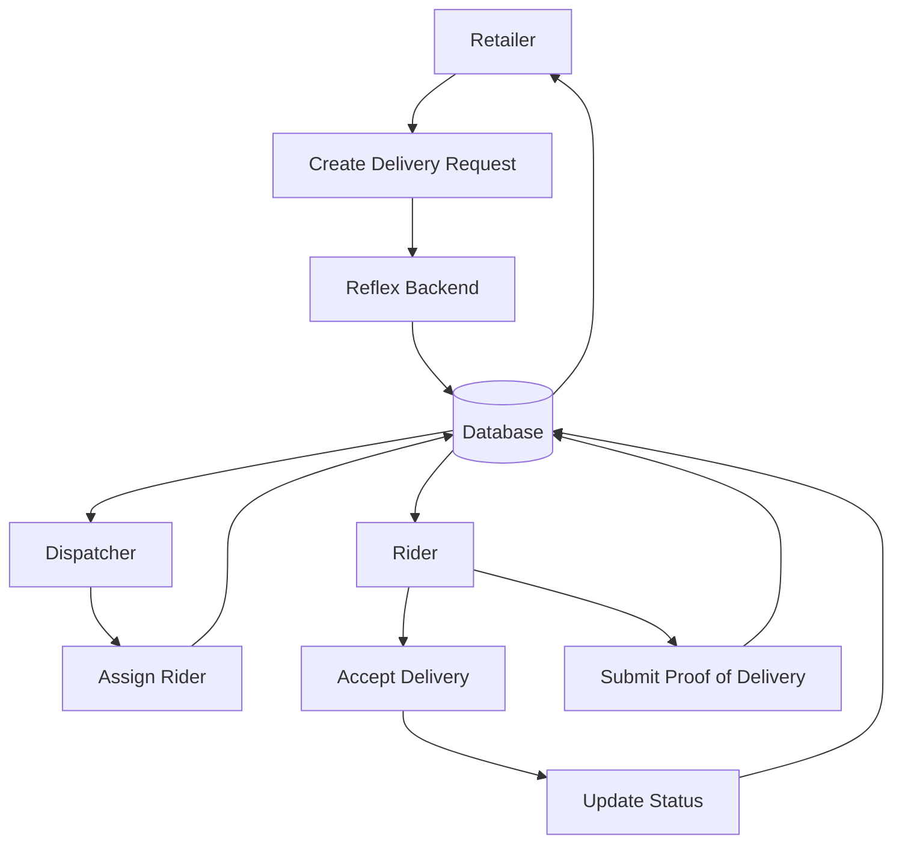
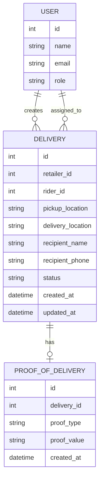

# REFLEX 

Reflex MVP is a complete full-stack delivery management application with a Vanilla HTML/CSS/JS frontend and a Django REST Framework backend.

## Project Structure

```text
reflex_web/
    ├── index.html
    ├── css/style.css
    ├── js/
    │   ├── api.js
    │   └── auth.js
    ├── retailer/
    │   ├── dashboard.html
    │   └── js/retailer.js
    ├── dispatcher/
    │   ├── dashboard.html
    │   └── js/dispatcher.js
    └── rider/
        ├── dashboard.html
        └── js/rider.js

reflex_api/
    ├── manage.py
    ├── requirements.txt
    ├── .env
    ├── config/
    ├── users/
    └── deliveries/
```

# Reflex

## Delivery Management System for Small Retailers

Reflex is a simple delivery management system designed for small Kenyan retailers such as electronics shops, pharmacies, and hardware stores.

It replaces delivery coordination through WhatsApp calls and phone calls with a simple system where retailers can create delivery requests, dispatchers can assign riders, and riders can update delivery status.

---

## Problem

Small retailers often manage deliveries using WhatsApp messages and phone calls.

This creates problems:

* No central record of deliveries
* Difficult to know who is handling an order
* No clear delivery status
* Poor visibility for retailers
* Difficult to confirm whether an order was delivered
* Information can easily be lost in chat messages

---

## Solution

Reflex provides one place to manage deliveries.

The basic flow is:

```text
Retailer
   ↓
Create Delivery Request
   ↓
Dispatcher
   ↓
Assign Rider
   ↓
Rider
   ↓
Update Delivery Status
   ↓
Proof of Delivery
   ↓
Retailer sees delivery status
```

---

## Users

### Retailer

The retailer can:

* Log in
* Create a delivery request
* View delivery status
* View assigned rider
* See completed deliveries
* View proof of delivery

### Dispatcher

The dispatcher can:

* View delivery requests
* Assign deliveries to riders
* View delivery status
* Monitor active deliveries

### Rider

The rider can:

* Log in
* View assigned deliveries
* Accept a delivery
* Update delivery status
* Submit proof of delivery

---

## Core Delivery Flow

A delivery follows a simple lifecycle:

```text
PENDING
   ↓
ASSIGNED
   ↓
ACCEPTED
   ↓
IN_TRANSIT
   ↓
DELIVERED
```

A delivery can also be cancelled:

```text
PENDING ─────→ CANCELLED
ASSIGNED ────→ CANCELLED
```

---

## System Workflow



---

## Main Components

Reflex is intentionally kept simple.

```text
Frontend
    ↓
Backend API
    ↓
Database
```

### Frontend

Provides the interface used by:

* Retailers
* Dispatchers
* Riders

### Backend API

Handles:

* Authentication
* Delivery requests
* Rider assignments
* Delivery status updates
* Proof of delivery

### Database

Stores:

* Users
* Deliveries
* Riders
* Assignments
* Delivery status
* Proof of delivery

---

## Basic Data Model



---

## Delivery Status

| Status       | Meaning                                      |
| ------------ | -------------------------------------------- |
| `PENDING`    | Delivery has been created but not assigned   |
| `ASSIGNED`   | Dispatcher has assigned a rider              |
| `ACCEPTED`   | Rider has accepted the delivery              |
| `IN_TRANSIT` | Rider is taking the delivery to the customer |
| `DELIVERED`  | Delivery has been completed                  |
| `CANCELLED`  | Delivery has been cancelled                  |

---

## API Overview

The backend exposes REST API endpoints.

### Authentication

```text
POST /api/auth/login/
POST /api/auth/logout/
```

### Deliveries

```text
GET    /api/deliveries/
POST   /api/deliveries/
GET    /api/deliveries/{id}/
PATCH  /api/deliveries/{id}/
DELETE /api/deliveries/{id}/
```

### Assignment

```text
POST /api/deliveries/{id}/assign/
```

### Status

```text
PATCH /api/deliveries/{id}/status/
```

### Proof of Delivery

```text
POST /api/deliveries/{id}/proof/
GET  /api/deliveries/{id}/proof/
```

> These endpoints describe the intended API structure. Update them if your implemented Django routes use different paths.

---

## Example Delivery

A delivery request may look like:

```json
{
    "pickup_location": "Kasarani",
    "delivery_location": "Westlands",
    "recipient_name": "John Doe",
    "recipient_phone": "07XXXXXXXX",
    "status": "PENDING"
}
```

After the dispatcher assigns a rider:

```json
{
    "status": "ASSIGNED",
    "rider_id": 12
}
```

After the rider completes the delivery:

```json
{
    "status": "DELIVERED"
}
```

---

## Technology Stack

The project uses a simple web application architecture.

```text
Frontend
   ↓
REST API
   ↓
Django
   ↓
PostgreSQL
```

### Technologies

* **Backend:** Django
* **API:** Django REST Framework
* **Database:** PostgreSQL
* **Frontend:** HTML / CSS / JavaScript


---


## Testing
Tests should cover the main delivery workflow:

```text
Create Delivery
      ↓
Assign Rider
      ↓
Accept Delivery
      ↓
Update Status
      ↓
Complete Delivery
      ↓
Submit Proof of Delivery
```

---

## Project  Scope

### Must Have

* User authentication
* Retailer creates delivery
* Dispatcher assigns rider
* Rider views assigned deliveries
* Rider updates delivery status
* Retailer views delivery status
* Proof of delivery
* Delivery history

### Not in MVP

To keep the project simple, the MVP does **not** have:

* Complex route optimization
* AI route planning
* Live GPS tracking
* Payment processing
* Multi-company billing
* Microservices
* Kubernetes
* Complex notification infrastructure

These can be considered later if the basic system proves useful.

---

## Security

Basic security requirements include:

* Passwords must be securely hashed
* API endpoints must require authentication where necessary
* Users should only access actions allowed by their role
* Sensitive environment variables must not be committed to GitHub
* Delivery information should only be visible to authorized users

Example:

```text
Retailer
   ↓
Can create and view their deliveries

Dispatcher
   ↓
Can assign riders and manage deliveries

Rider
   ↓
Can view and update assigned deliveries
```

---

## Success Criteria

The MVP is successful if a retailer can:

```text
Create a delivery
      ↓
Dispatcher assigns a rider
      ↓
Rider accepts the delivery
      ↓
Rider updates the status
      ↓
Rider delivers the order
      ↓
Rider submits proof
      ↓
Retailer sees DELIVERED
```

The key goal is simple:

> **Replace scattered WhatsApp and phone-based delivery coordination with one reliable delivery record.**

---

## Future Improvements

After the MVP is stable, Reflex could add:

* Real-time delivery tracking
* SMS/WhatsApp notifications
* GPS location
* Route optimization
* Analytics dashboard
* Multiple retailer accounts
* Rider performance reports
* Customer delivery notifications

These should come **after** the core delivery workflow works reliably.

---


